# 소프트웨어 설계

 

#### 요구사항

    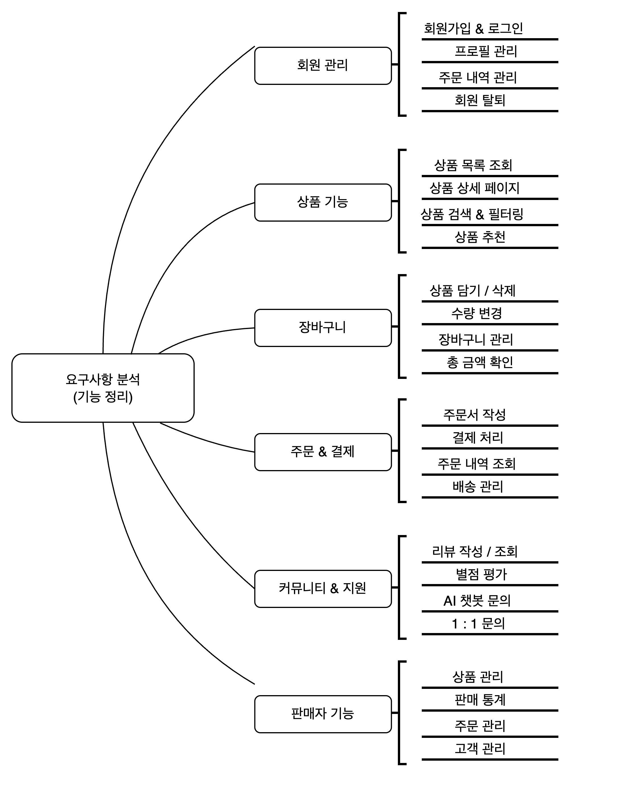

 

 

#### Usecase Diagram

    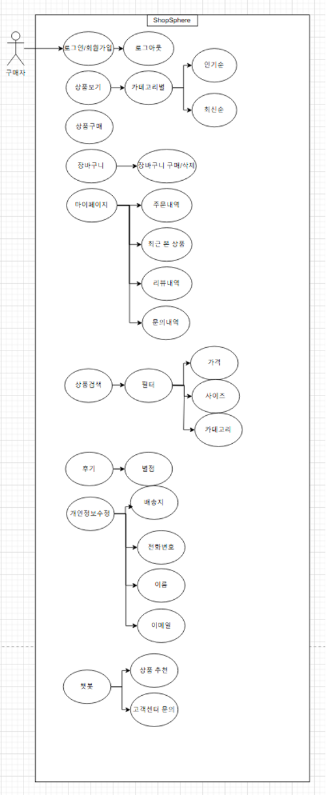

    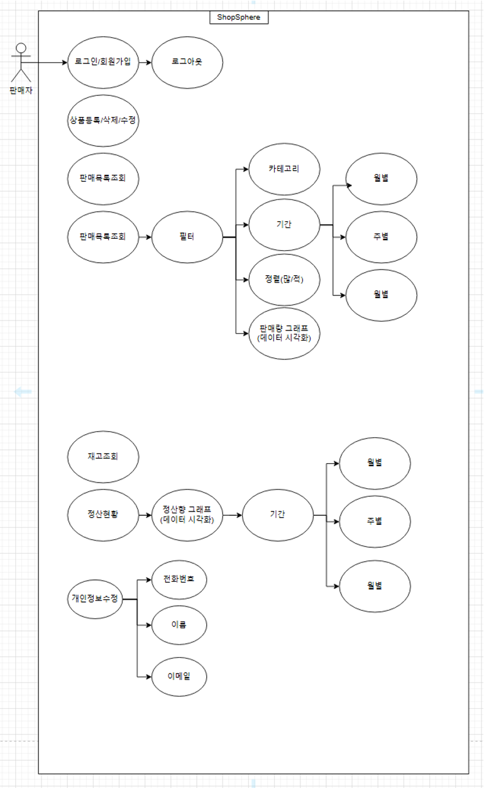

 

 

#### Class Diagram

    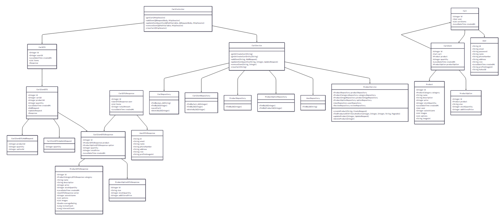
    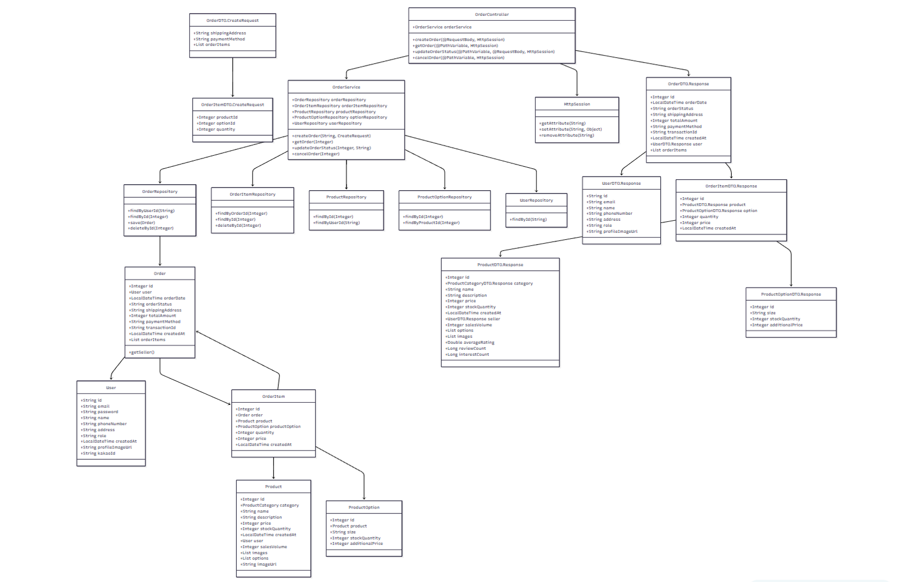
    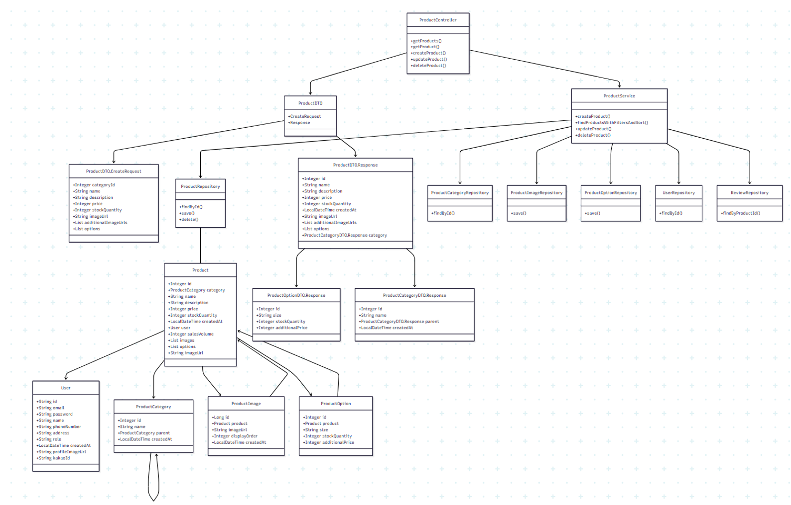
    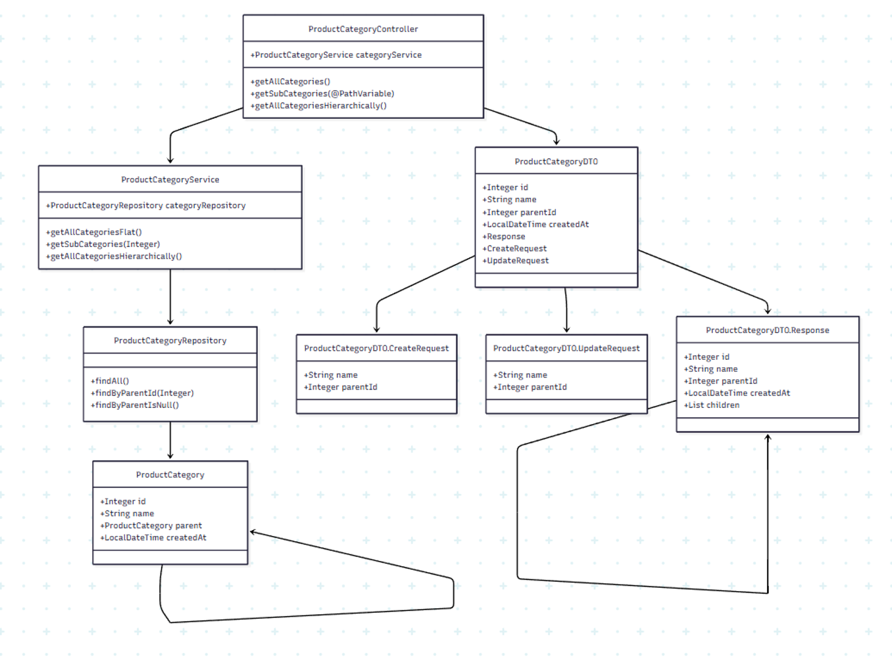
    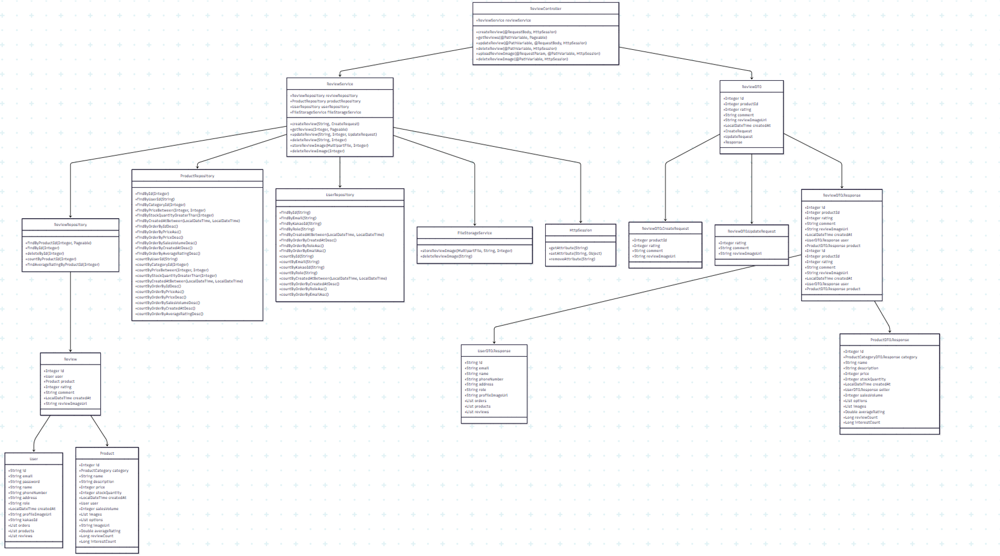
    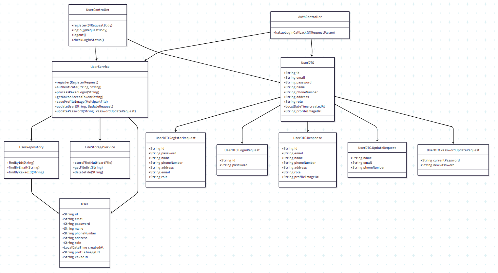
    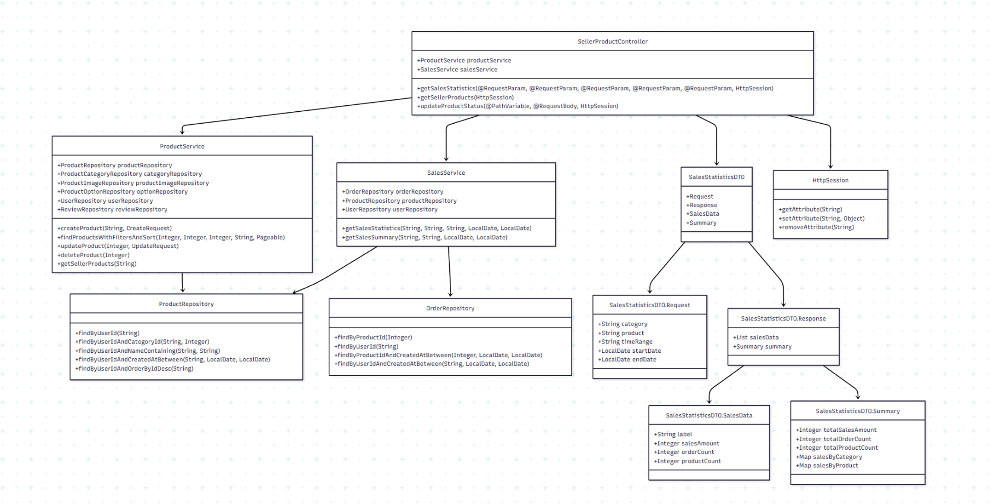
    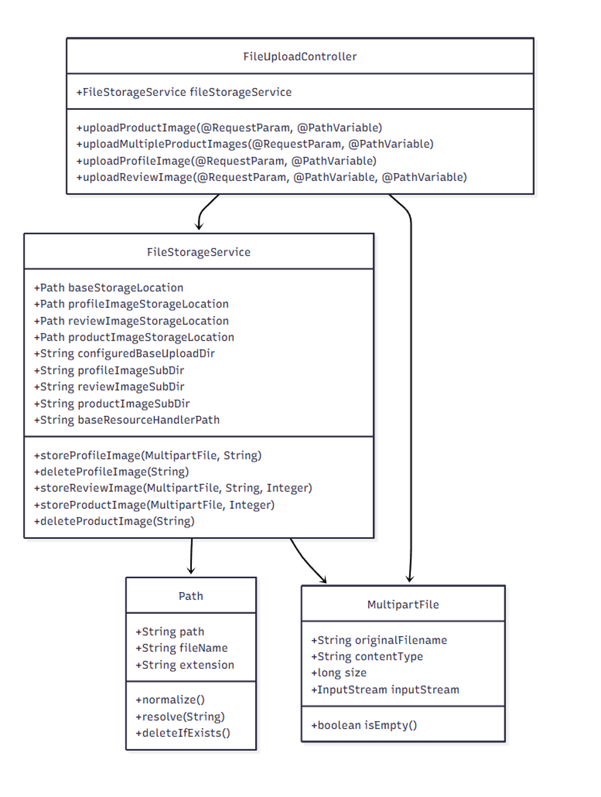

 

 

#### Sequence Diagram
#### 상품검색

    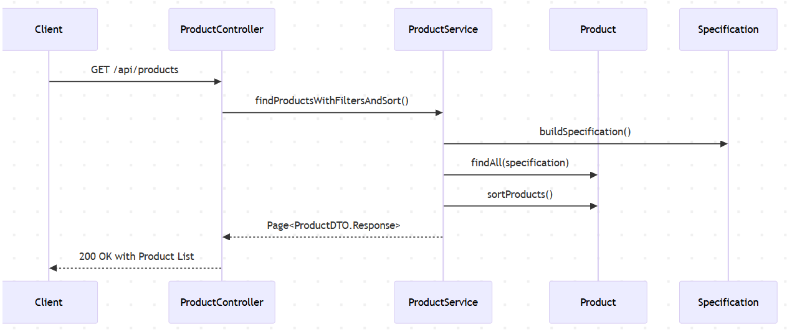

 

#### 상품구매

    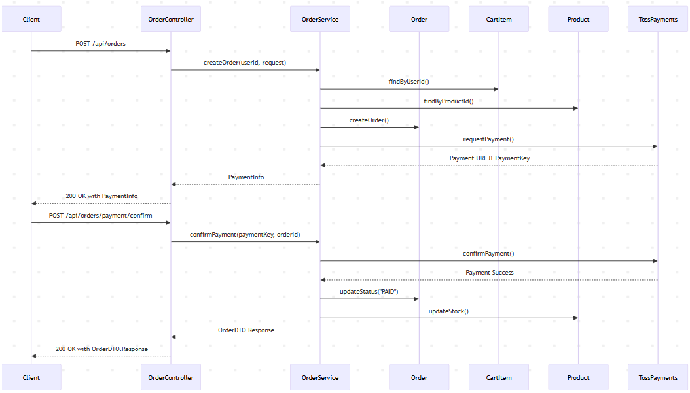

 

#### 상품등록

    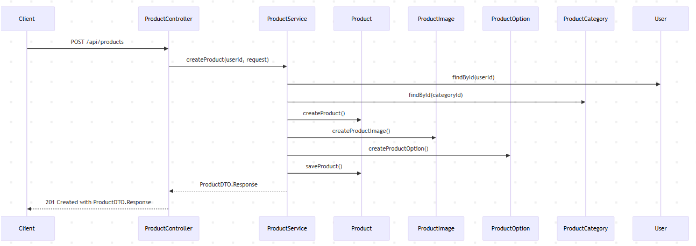

 

 

#### ERD

    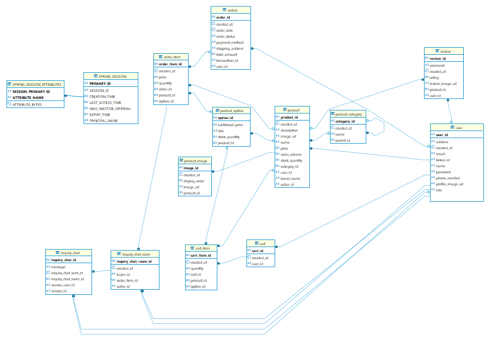

 

 

